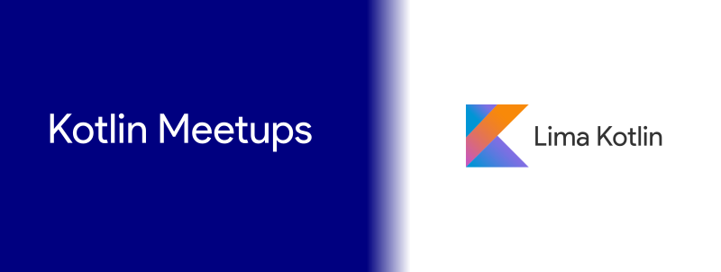

# Kotlin Meetups
Sesiones de las Kotlin Meetups de [Lima Kotlin](https://www.facebook.com/groups/limakotlin)

## Próximos Meetups

### Kotlin Meetup #02 - Abril 18, 2017

_Nuestro segundo meetup. Este evento es co-organizado con los chicos del [GDG Open](https://www.facebook.com/gdgopen) y con el apoyo de [Innova Zone Coworking](https://www.facebook.com/InnovazoneCoWorking/) y [Silabuz.com](http://www.silabuz.com)_

### Meetups Pasados

##### Kotlin Meetup #01 - Marzo 25, 2017

_Nos unimos a los [eventos oficiales](https://kotlinlang.org/community/talks.html?time=kotlin) por el release de **Kotlin 1.1** en los cuales además de las charlas pudimos revisar y votar por las características futuras propuestas para la siguiente versión de Kotlin. La interacción por redes sociales fue con el hashtag [#kotlinevent](https://twitter.com/search?q=%23kotlinevent). Este evento fue co-organizado con los chicos de [Java for Android Technet](https://www.meetup.com/es-ES/Java-For-Android-TechNet)._

* **Demo Presentation (Inglés) and Q&A** por [Andrey Breslav](https://twitter.com/abreslav)  
  [Youtube Streaming](https://www.youtube.com/watch?v=QQKdFFRqamg&feature=youtu.be)

* **Introducción a Kotlin para Desarrolladores Android** por [Armando Picón](http://twitter.com/devpicon)  
   [Slides](https://speakerdeck.com/devpicon/introduccion-a-kotlin-para-android-developers) |
  [Demo 1 - Test Android Marvel Comic App](https://github.com/DevPicon/test-android-marvel-comic)
  | [Demo 2 - Eventech](https://github.com/DevPicon/kotlin-agenda-tech-latam)

### Nuestras redes sociales:

* Facebook [https://www.facebook.com/groups/limakotlin](https://www.facebook.com/groups/limakotlin)
* Twitter [https://twitter.com/limakotlin](https://twitter.com/limakotlin)
